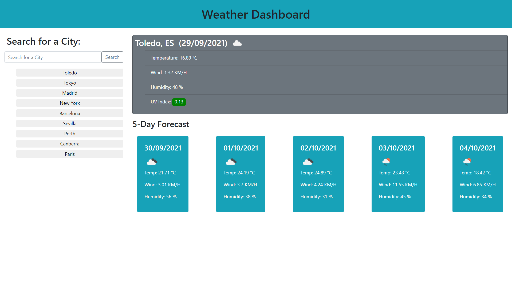

# Weather Dashboard

This weather dashboard allows the user to enter a city in the search input and will show different weather data on the screen.

It will also show a 5 day forecast with the main data for the same city.

On the left side it has the last 10 cities searched to have easy access.

It has been created with **HTML/CSS/JavaScript**.

## Website Screenshots

-This screenshot shows the main page.

## Link to Deployed Application

https://grillogg.github.io/Day-Planner/